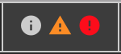
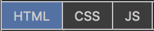
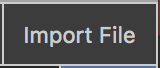

# Wingman

### An In-Browser `html` / `css` / `javascript` Text Editor

## [Try It Here!](https://tiredamage42.github.io/SitePrototyper/)
- Uses [Ace](https://ace.c9.io "Visit the Ace homepage") for text highlighting

# How to Use:
- **Update View:** `[Ctrl/Cmd]-S` 

- **Toggle Console:** `[Ctrl/Cmd]-Shift-C` 

- **Settings:** [ Font Size, Editor Color Theme, Text Wrap ] 

- **Language Selection** 

- **View All Editor Shortcuts** 

- **Import File To The Current Editor** `[Ctrl/Cmd]-I` 

- **Export Project Files** `[Ctrl/Cmd]-E` 

 
 
 

# To-Do:

- Option to switch font
- Finalize CSS layout and color scheme to make it look nice.
- Deployment To Github Repo / Pages
- Import/Export from/to git
- Fix 'local' links that shouldnt open in a new tab
- Permanent shortcuts view
- Body Tag classes, id, etc...
- Persistent projects that can be linked to
- offsite embedding
- rename project
